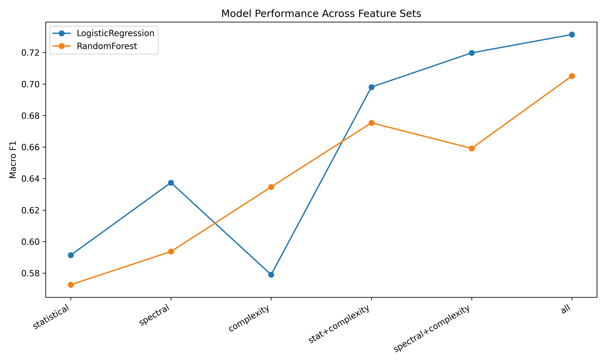
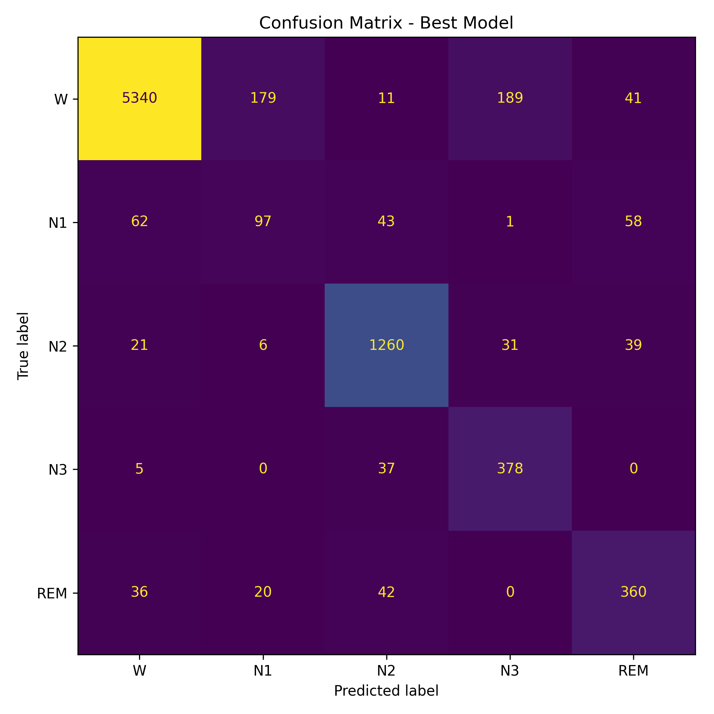
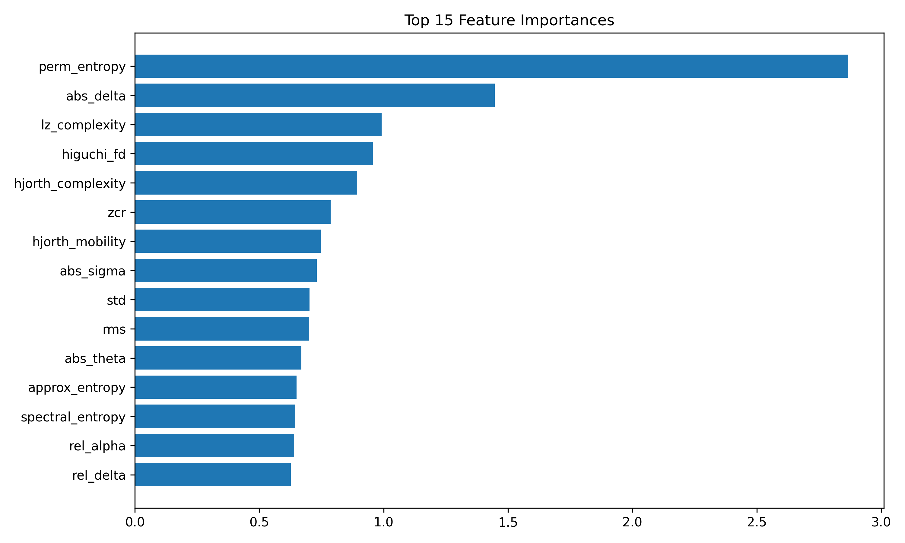

# 🧠 EEG-Based Sleep Stage Classification using Neural Complexity

---

## 📌 Overview

This project presents an end-to-end system for **sleep stage classification from EEG signals**, incorporating **neural complexity measures** alongside traditional handcrafted features.

> **Key Insight:** Brain states are not only defined by frequency patterns — they also differ in signal complexity and structure.

---

## 🎯 Problem Statement

Traditional EEG classification methods rely primarily on spectral (frequency) features.

However:

> Can incorporating **signal complexity** improve classification performance and reliability?

---

## ⚙️ Methodology

### 🔄 Pipeline

```
Raw EEG Signal
      ↓
Segmentation (30s epochs)
      ↓
Feature Extraction
  ├── Statistical
  ├── Spectral
  └── Complexity ⭐
      ↓
Machine Learning Models
      ↓
Sleep Stage Prediction
```

---

## 🧠 Feature Engineering

### Statistical

* Mean, variance, skewness
* Hjorth parameters

### Spectral

* Delta, Theta, Alpha, Beta power
* Spectral entropy
* Peak frequency
* Spectral edge frequency (SEF95)

### Complexity (Core Contribution)

* Sample entropy
* Approximate entropy
* Permutation entropy
* Higuchi fractal dimension
* Lempel-Ziv complexity

---

## 🤖 Models & Evaluation

* Logistic Regression
* Random Forest

Validation:

* **Stratified Group K-Fold** (no subject leakage)

Metrics:

* Macro F1
* Balanced Accuracy
* **Cohen’s Kappa**

---

## 📊 Results (Mean ± Std)

| Feature Set           | Model         | Macro F1          | Kappa             |
| --------------------- | ------------- | ----------------- | ----------------- |
| Statistical           | LR            | 0.591 ± 0.071     | 0.651 ± 0.141     |
| Spectral              | LR            | 0.637 ± 0.093     | 0.643 ± 0.161     |
| Complexity            | RF            | 0.635 ± 0.020     | 0.744 ± 0.010     |
| Stat + Complexity     | LR            | 0.698 ± 0.062     | 0.770 ± 0.090     |
| Spectral + Complexity | LR            | 0.720 ± 0.050     | 0.796 ± 0.059     |
| **All Features**      | **LR (Best)** | **0.731 ± 0.040** | **0.806 ± 0.056** |

---

## 🧠 Key Findings

### 1. Complexity matters

* Complexity-only model:

  * Kappa = **0.744**
* Spectral-only:

  * Kappa = **0.643**

👉 Complexity captures **non-linear brain dynamics**

---

### 2. Best performance comes from combining features

* Spectral + Complexity → strong improvement
* All features → best result

---

### 3. Stability improved

Lower std with complexity → more reliable predictions

---

## 🔍 Per-Class Performance (Best Model)

| Stage | F1 Score |
| ----- | -------- |
| Wake  | 0.95     |
| N1    | 0.34 ⚠️  |
| N2    | 0.92     |
| N3    | 0.74     |
| REM   | 0.75     |

### Insight:

* N1 is hardest → known challenge in sleep research
* Strong performance in Wake, N2

---

## 📉 Statistical Testing (Wilcoxon)

Wilcoxon signed-rank tests were performed on fold-level results.

* No statistically significant differences (p > 0.05)
* Expected due to small sample size (3 folds)

👉 However:

* consistent performance gains observed
* effect size visible even without significance

---

## 📈 Visual Results





---

## 🎬 Interactive Demo

Run:

```bash
streamlit run app.py
```

### Features

* EEG visualization
* Brain state prediction
* Confidence scores
* Feature explanation panel

---

## 💡 Contributions

* Introduced **complexity-aware EEG representation**
* Demonstrated **performance improvements**
* Added:

  * standard deviation analysis
  * Wilcoxon statistical testing
  * per-class evaluation
* Built **interactive AI demo system**

---

## ⚠️ Limitations

* Small dataset (3 subjects)
* Single-channel EEG
* Limited statistical power

---

## 🚀 Future Work

* Larger datasets
* Deep learning models
* Quantum kernel methods (QSVC)
* Real-time EEG systems

---

## 🧠 Conclusion

> Brain states are complex dynamical systems, not just frequency patterns.

By incorporating complexity:

* performance improves
* representation becomes richer
* system becomes more robust


